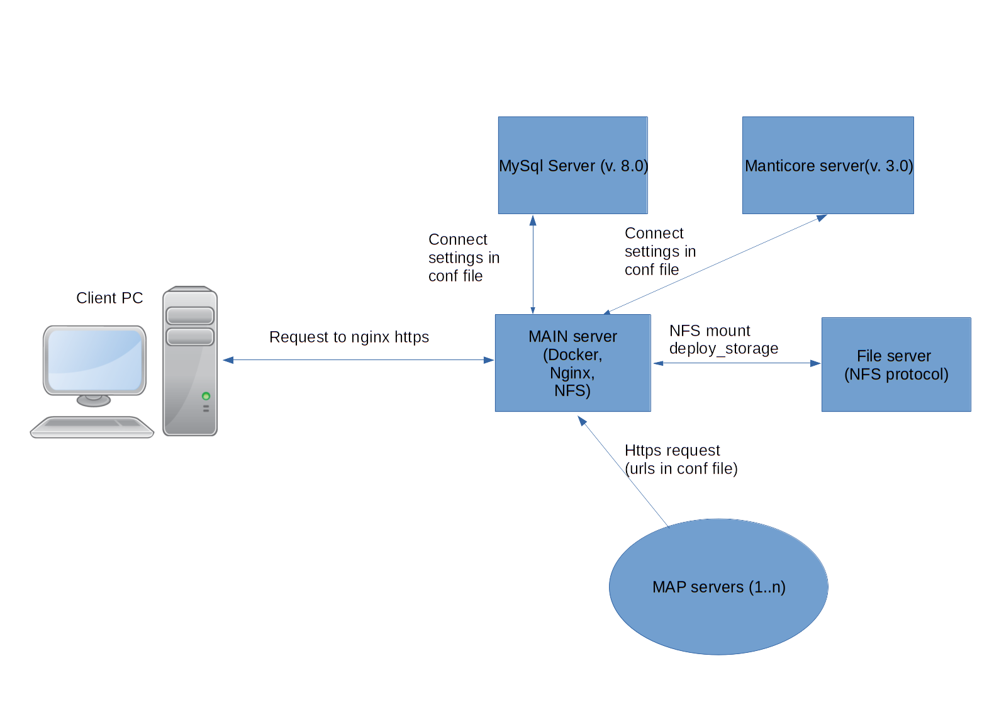

# САПФИР
## Организация проекта
### Backend
#### Структура
Backend часть САПФИР представляет собой API сервер реализованный посредством языка программирования python и фреймворка django. Структурно проект разделен на:
* core - ядро проекта, содержащая файлы настроек для режима разработки и развертывания, общую схему маршрутизации и функции обертки, настройки логирования.
* authentication - модуль аутентификации пользователя.
* classifier - модуль отвечающий за работу с классификаторами (преимущественно в режиме администратора)
* data_base_driver - модуль отвечающий за работу с mysql и manticore
* django_monaco_editor - модуль отвечающий за область ввода кода скриптов в интерфейсе администратора
* document_driver - модуль отвечающий за работу с документами word и exel
* files - модуль отвечающий за загрузку/выгрузку пользовательских файлов и отчетов
* notifications - модуль отвечающий за работу с оповещениями
* objects - модуль отвечающий за обработку работы с объектами и их связями
* official_documents - модуль отвечающий за обработку запросов работы с отчетами
* script - модуль отвечающий за работу с отчетами и частично триггерами
* synonyms_manages - модуль отвечающий за взаимодействие с системой поиска синонимов
* vector_parser - модуль отвечающий за конвертирование информации из старых источников

Также проект содержит файл requirements.txt содержащий список зависимостей для работы сервера и ряд файлов необходимых для создания Docker образа.

#### Разработка
Для запуска сервера в режиме разработки необходимо в папке backend создать виртуальное окружение python и установить зависимости из файла requirements.txt (или не создавая виртуального окружения установить python и зависимости глобально, что не рекомендуется). Далее необходимо прописать настройки подключения к mysql и manticore в файлах backend/data_base_driver/constant/connect_db.py и backend/data_base_driver/constant/const_fulltextsearch.py (настройка данных серверов описана в разделе Развертывание). Следующим шагом необходимо собрать статические файлы в папку backend/static (описано в разделе Frontend). Последним шагом для запуска сервера необходимо находясь в папке backend выполнить команду " ./manage.py runserver". Сервер будет запущен на порту 8000 по адресу 127.0.0.1.

#### Сборка docker образа
Для развертывания проекта необходимо собрать проект в docker образ. Для этого находясь в папке backend необходимо выполнить команду "sudo docker build -t saphir". Для сохранения полученного образа в файл необходимо выполнить команду "sudo docker save saphir > /path/saphir.tar", где /path/saphir.tar - желаемый путь и название файла.

#### Сборка статических файлов для развертывания
Для развертывания приложения необходимо сгенерировать статические файлы frontend и интерфейса администратора, так как backend самостоятельно их отдает только в режиме разработки. В первую очередь необходимо сгенерировать статические файлы frontend как описано в разделе Frontend/Генерация финальных статических файлов. Далее необходимо в папке backend выполнить команду "./manage.py collect static". Все статические файлы проекта необходимые для развертывания на выделенном сервере будут сгенерированы в папку backend/var/static_root.

### Frontend
#### Структура
Frontend представляет собой web приложение реализованное посредством языка программирования javascript фреймворка Vue js.
Структурно проект разделен на:
* assets - статические файлы (например изображения) необходимые для работы проекта.
* components - основные компоненты системы, в свою очередь подразделены на:
  * Graph - модуль графов
  * Map - модуль карты
  * Reports - модуль отчетов
  * WebsiteShell - набор компонентов общих для всех страниц
* plugins - набор вспомогательных утилит
* router - модуль отвечающий за маршрутизацию в проекте
* views - главные файлы основных компонентов

#### Разработка
Для запуска режима разработки необходимо установить на компьютере разработчика менеджер javascript пакетов npm и vue cli. Далее для установки зависимостей необходимо в папке frontend выполнить команду "npm install" (зависимости будут автоматически подтянуты из файла package.json). Наконец для запуска сервера разработки в папке frontend необходимо выполнить команду "npm run serve". После окончания работы команды статические файлы будут автоматически сгенерированы в папку backend/static. 

#### Генерация финальных статических файлов
Для генерации статических файлов в режиме развертывания необходимо в папке frontend выполнить команду "npm run build". По завершению выполнения команды статические файлы будут сохранены в папке backend/static.

## Развертывание

### Общая структура

САПФИР представляет собой программный комплекс состоящий из следующих компонентов:
* Главный сервер
* Файловый сервер
* Сервер MySql
* Сервер Manticore
* Сервер(а) картографии

Предварительные настройки серверов отражены в соответствующих файлах.

### Главный сервер
[Пример предварительной настройки](documents/saphir%20server.txt). Должны быть установлены Docker, Docker-compose и NFS client для монтирования папок с файлового сервера (допускается использовать локальные папки). Предназначен для обработки запросов от пользователя через web сервер NGINX развернутый в docker контейнере(загрузка статических файлов и проксирование запросов к API к серверу приложения). Сервер приложения разворачивается через docker-compose путем запуска 2-х контейнеров. 
NGINX docker образ собирается из Dockerfile лежащего в папке nginx. Для сборки необходимо в данной папке выполнить команду "sudo docker build -t saphir_nginx"
Для работы сервера в корне файловой системы должна быть создана папка deploy_storage (sudo mkdir /deploy_storage). В данную папку необходимо загрузить папку static (собранная статика фронтенда и интерфейса администратора), конфигурационный файл config.json ([пример](documents/config.json)), папки saphir_data (для хранения пользовательских файлов), saphir_documents(для хранения сгенерированных отчетов) и log(для хранения логов). 
Для запуска необходимых сервисов необходимо перенести на сервер docker образы описанные выше и файл docker-compose из корня проекта. Далее, в каталоге, где находится файл docker-compose, необходимо выполнить команду "sudo docker-compose up -d". 

### Файловый сервер
Предназначен для хранения пользовательских и статических файлов. [Пример предварительной настройки](documents/ftp%20server.txt). 

### Сервер MySsql
Предназначен для хранения пользовательских и системных данных и их резервного копирования. [Пример предварительной настройки](documents/mysql%20server.txt). Должен быть установлен MySql сервер 8 версии(или старше) и опционально для передачи конфигурационных файлов NFS клиент(для монтирования удаленных папок).
[Скрипт развертывания общей структуры](documents/vec_data.sql).(Администратор - login=admin, password=A123B456) Настройки подключения приложения к базеданных прописываются в config.json файле и включают:
* HOST - ip  адрес сервера
* PORT - порт MySql сервера
* NAME - название базы данных
* USER - имя пользователя
* PASSWORD - пароль для пользователя
* CHARSET - кодировка (UTF 8)

Для резервного копирования базы данных необходимо выполнить команду "sudo mysqldump vec_data > /path/vec_data.sql", где vec_data -  название копируемой базы данных, path - путь куда будет помещен файл.

### Сервер Manticore
Предназначен для хранения пользовательских данных и ускорение операций текстового поиска. [Пример предварительной настройки сервера](). Должен быть установлен Manticore сервер 3 версии(или старше) и опционально для передачи конфигурационных файлов NFS клиент(для монтирования удаленных папок). Пример конфигурационного файла [manticore.conf](documents/manticore.conf). Файл включает следующие блоки:
* Блок источников данных. Содержит информацию о MySql сервере и конкретных таблицах которые подлежат индексированию. Для каждой таблицы указывается типы переменных и sql запрос по их получению. Допускается наследование. В рамках САПФИР должны быть проиндексированы все ROW и COL таблицы.
* Блок индексов. Содержит название и настройки каждого конкретного индекса. В рамках САПФИР всем ROW и COL таблицам соответствия 2 индекса: плановый и реального времени. Плановый предназначен для внесения данных из MySql базы данных при развертывании, реального времени для работы приложения. Каждому индексу должна соответствовать уникальная папка в файловой системе сервера (Manticore не умеет создавать папки самостоятельно - необходимо создать руками через mkdir для каждого индекса).
* Общая конфигурация сервера. Содержит номера портов для эмуляции соединения MySql (на данный момент не используется в САПФИР) и обработки Http запросов, папки хранения log и pid файлов и иные настройки. Подробнее.

Для развертывания Manticore необходимо переместить(создать) описанный выше конфигурационный файл. Очистить папки хранящие индексы после чего запустить индексирование командой "indexer --config /path/manticore.conf --all --rotate", где /path/ - путь к конфигурационному файлу. После выполнения данной команды необходимо запустить сам сервер командой "searchd --config /path/manticore.conf", где /path/ - путь к конфигурационному файлу. Далее необходимо передать информацию из плановых индексов в индексы реального времени. Это выполняется через эмулятор mysql соединения с manticore сервером (для соединения необходимо выполнить команду "mysql -h127.0.0.1 -P9306", где h127.0.0.1 - адрес сервера, P9306 - порт mysql соединения). Команда для перемещения информации "ATTACH INDEX obj_row_pl TO RTINDEX obj_row;", где obj_row_pl - название планового индекса, obj_row - название соответствующего ему индекса реального времени. Можно объединить все команды перемещения данных в [один sql скрипт](documents/attach_script.sql) и выполнить следующим образом "mysql -h127.0.0.1 -P9306 < /path/atach_script.sql", где /path/atach_script.sql - путь к скрипту.

### Сервер(а) картографии
Предназначены для формирования(хранения картографических плиток) и их выдаче клиенту по запросу. Информация о картографических серверах прописывается в config.json файле главного сервера и содержит:
* id - идентификатор сервера.
* title - название слоя
* subtitle - дополнительное название слоя
* url - шаблон запроса для выдачи плиток
* crs - тип смещения если есть

[Пример настройки OSM сервера](documents/map_osm_server.txt)
